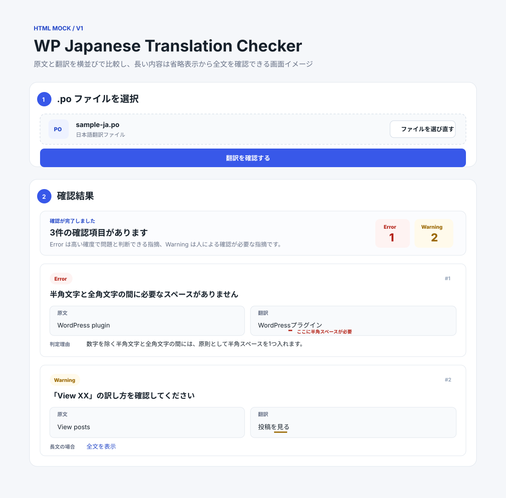

# WP Translation Checker v1 基本設計書

## 目的

本書は、WP Translation Checker（WTC）v1 における利用者から見える振る舞いを定義する。

WTC v1 では、利用者が `.po` ファイルを選択し、対応する WordPress 日本語翻訳スタイルのルールに沿って確認し、翻訳を提出する前に結果を理解できるようにする。

本書では、画面、操作、状態、メッセージ、フォーカスの振る舞いを定義する。実装構造、PO 解析方法、判定アルゴリズム、内部の状態管理方式は定義しない。

## 設計原則

- 利用フローは「`.po` ファイルを選択し、確認結果を確認する」という1つの目的に集中させる。
- 正常に確認できた状態と、確認を実行できなかった状態を明確に分ける。
- Error と Warning は確実性の異なる指摘として扱い、同じ意味の失敗として見せない。
- 各指摘には、利用者自身が確認の必要性を判断できるだけの情報を示す。
- WordPress 日本語翻訳スタイルガイドを一次情報として扱い、各指摘から確認できるようにする。
- v1 には、ファイル編集、修正版生成、結果エクスポート、GlotPress との直接統合、ロケール選択を追加しない。
- 意味の違いを色だけで伝えない。
- 選択された翻訳内容はブラウザー内で扱い、確認処理のために外部サービスへ送信しない。

## 基本的な利用フロー

1. 利用者が WTC を開く。
2. 利用者が `.po` ファイルを選択する。
3. WTC が選択されたファイルを表示し、確認を開始できる状態にする。
4. 利用者が確認を開始する。
5. WTC が、ファイルを確認可能か、対象ロケールを判定できるか、対応ロケールかを確認する。
6. ファイルを正常に確認できない場合、WTC は理由を示し、正常な確認結果としては扱わない。
7. ロケールを判定できない場合、WTC は対象ロケールを特定できないため確認を実行できないことを示す。
8. ロケールを判定できるが未対応の場合、WTC は判定したロケールと、v1 が日本語（`ja`）のみ対応していることを示す。
9. 確認が正常に完了した場合、WTC は結果概要を表示する。
10. 指摘がある場合、利用者は個々の Error / Warning を確認する。
11. 指摘がない場合、WTC は確認が正常に完了し、v1 の対象ルールでは問題が検出されなかったことを明確に示す。
12. 正常完了後、利用者は現在の確認結果全体を CSV / JSON で保存するか、Markdown でコピーできる。

以下の各領域は同一画面上に配置できる。本設計は、画面遷移を必須とはしない。

## 画面上の主要領域

### ファイル入力領域

ファイル入力領域は、確認作業の開始地点とする。

以下を表示する。

- `.po` ファイルを選択するための操作
- 選択後のファイル名
- ファイル選択後に確認を開始するための操作

ファイル未選択時は、まだ確認が行われていないことが分かる状態とし、結果が存在するようには見せない。

別のファイルが選択された場合、そのファイルを新しい確認対象として扱う。以前の確認結果を、新しく選択したファイルの結果と誤認させない。

### 重要なフィードバック領域

WTC が確認を完了できない場合、重要なフィードバック領域で理由を説明する。

この領域では、少なくとも以下の状態を扱う。

- 選択されたファイルを読み取れない、または確認可能な `.po` ファイルとして扱えない
- 対象ロケールを判定できない
- 対象ロケールは判定できるが未対応である

メッセージでは、何が起きたかと、別の `.po` ファイルを選択するなど利用者が次に行えることを示す。

この領域では、「問題がありませんでした」と誤解される表現を使用しない。

### 結果概要領域

確認が正常に完了した後、結果概要領域で以下を確認できるようにする。

- 確認が完了したこと
- Error 件数
- Warning 件数
- v1 の対象ルールで問題が検出されなかったかどうか

利用者が個々の指摘を読む前に全体像を把握できるよう、結果概要は指摘一覧より先に配置する。

結果概要では、確認完了のメッセージと Error / Warning の件数を同じまとまりの中で確認できるようにする。Error 件数と Warning 件数は、それぞれの種別と件数の対応が一目で分かるように並べて表示する。

Error / Warning は、視覚的な表現だけでなく文字ラベルでも識別できるようにする。

### ルールによる指摘の絞り込み

確認が正常に完了し1件以上の指摘がある場合、指摘一覧の前にルールフィルターを表示する。

初期状態は「すべてのルール」とし、現在の確認結果に実際に含まれるスタイルガイド項目だけを単一選択の候補として提示する。同じスタイルガイド項目が複数の指摘に含まれる場合も選択肢は1つとし、各選択肢には1つの指摘を1件として集計した現在の指摘件数を表示する。

1つのルールを選択した場合は、そのスタイルガイド項目に該当する Error / Warning の両方を指摘一覧へ表示する。「すべてのルール」へ戻した場合は、現在の確認結果に含まれるすべての指摘を表示する。

指摘一覧の件数表示は現在表示している指摘数に合わせる。一方、結果概要の Error / Warning 件数は正常完了した確認結果全体の件数を維持し、ルールフィルターによって変更しない。

別のファイルを選択した場合や新しい確認を開始した場合は、以前のルール選択を引き継がず、新しい確認結果では「すべてのルール」から表示する。

ルールフィルターの変更だけでファイル確認を再実行しない。

### 結果の保存・コピー

確認が正常に完了した場合、結果概要領域から現在の確認結果を以下の形式で共有・保存できるようにする。

- CSV をファイルとして保存する
- JSON をファイルとして保存する
- Markdown をクリップボードへコピーする

保存・コピー操作は、指摘の有無にかかわらず正常完了時に利用できる。

画面上でルールフィルターやページネーションを使用している場合も、それらは表示だけに作用する。保存・コピーする内容は常に現在の確認結果全体とし、表示中のルールやページだけへ限定しない。

Markdown では各指摘の `matches` に該当する翻訳部分を `**...**` で太字にする。CSV / JSON の翻訳文字列は元の文字列を保持し、表示装飾を埋め込まない。JSON では `matches` を構造化されたチェック結果として保持してよい。

Markdown のコピーに成功した場合は完了を通知する。ブラウザーがクリップボード書き込みを利用できない場合や書き込みに失敗した場合は、成功として扱わずコピーできなかったことを通知する。

未確認、確認中、確認不能、未対応ロケールなど正常完了していない状態では、結果の保存・コピー操作を提示しない。別のファイルが選択された場合は、以前の確認結果を新しい入力の結果として保存・コピーできる状態に残さない。

### 指摘一覧

1件以上の指摘がある場合、各指摘を一定した分かりやすい順序で表示する。

各指摘から、利用者が少なくとも以下を確認できるようにする。

- どの翻訳が対象か
- Error / Warning のどちらか
- 何が問題として検出されたか、または何を確認すべきか
- WordPress 日本語翻訳スタイルガイドのどの項目が根拠か
- 一次情報をどこで確認できるか

各指摘には、少なくとも以下を表示する。

- Severity: Error または Warning
- 日本語 v1 Check が返した指摘メッセージ
- 原文
- 対象となった翻訳
- 対応するスタイルガイドの項目
- WordPress 日本語翻訳スタイルガイドへのリンク

各指摘は1件ごとのまとまりとして表示し、上から次の順に確認できるようにする。

1. Error / Warning の種別
2. 指摘メッセージ
3. 原文と翻訳の比較
4. 対応するスタイルガイド項目と一次情報への導線

原文と翻訳は、利用者が対応関係を比較しやすいよう、同じ比較領域の中に配置する。十分な画面幅がある場合は「原文」「翻訳」を左右に並べ、双方を同時に見比べられるようにする。狭い画面では読みやすさを優先し、「原文」「翻訳」の順で縦方向に配置する。

原文または翻訳が長い場合は、指摘全体の把握を妨げない範囲で省略表示する。省略した内容には「全文を表示」など内容全体を確認できる明確な操作を用意し、展開後は必要に応じて再び折りたためるようにする。原文と翻訳の一方だけが長い場合は、その内容だけを展開できるようにし、もう一方の表示まで不必要に変化させない。

`CheckMessage.matches` が存在する翻訳では、各 `[start, end)` に該当する範囲を薄い赤系の背景と太字で強調する。文字色だけでは意味を伝えず、Error / Warning の Severity 表現とは分離する。折りたたみ表示では表示中の範囲だけを強調し、全文表示後は元の位置情報で全該当箇所を表示する。

指摘メッセージは、日本語 v1 Check の `CheckMessage.message` をそのまま利用し、Presentation 側で個別ルールの判定理由を再構成しない。利用者は、指摘メッセージ、原文・翻訳の比較、対応するスタイルガイド項目を組み合わせて、何が問題として検出され、なぜ指摘されたかを理解できるようにする。原文条件を伴う Warning では、原文と翻訳の比較を利用者の判断材料とする。

スタイルガイドの項目名と一次情報への導線は、各指摘の末尾で同じまとまりとして確認できるようにする。

`.po` ファイル内に、対象箇所の特定に役立つ参照情報が存在する場合は、補助情報として表示してよい。ただし、その情報が存在しない場合まで必須とはしない。

### 問題なしの完了表示

確認が正常に完了し、Error も Warning も検出されなかった場合、WTC はそのことを明確に表示する。

表示では、以下の2点を伝える。

- ファイルの確認が正常に完了したこと
- v1 が対応するルールでは問題が検出されなかったこと

翻訳全体が完全に正しいことや、WordPress 日本語翻訳スタイルガイドのすべてを満たしていることを保証する表現にはしない。

## 利用者から見える状態

### ファイル未選択

利用者は `.po` ファイルを選択できる。

確認結果は表示しない。

### ファイル選択済み

選択されたファイル名を表示し、利用者が確認を開始できる。

以前の確認結果を、このファイルの結果として表示しない。

### 確認中

利用者が確認を開始した後、WTC が選択されたファイルを確認中であることを示す。

この状態では、同じ確認を誤って重複実行しないようにする。

確認が正常に完了するか、継続できない状態になった時点で確認中表示を終了する。

### ファイルを正常に確認できない

WTC は、ファイルを確認できなかったことを説明する。

この状態は、正常に確認した結果として指摘が0件だった状態とは明確に区別する。

利用者は別のファイルを選択して再度確認できる。

### ロケールを判定できない

ファイル自体はロケール判定を試みられるところまで読み取れたが、対象ロケールを特定できない状態とする。

WTC は、ロケールを特定できないため確認を継続できないことを説明する。

この状態は、未対応ロケールとは分けて扱い、正常結果としても扱わない。

### 未対応ロケール

WTC は対象ロケールを特定できるが、v1 の対応範囲外である状態とする。

判定できたロケールを表示可能な場合は表示し、v1 が日本語（`ja`）のみを確認対象としていることを説明する。

そのファイルに対して、日本語固有ルールによる確認結果は表示しない。

### 指摘ありで正常完了

WTC は結果概要と指摘一覧を表示する。

利用者は Error / Warning を区別し、各指摘の理由とスタイルガイド上の根拠を確認できる。

### 指摘なしで正常完了

WTC は結果概要と問題なしの完了表示を示す。

利用者は、この状態を「確認できなかった状態」と明確に区別できる。

## Error / Warning の見せ方

### Error

Error は、対応するルールの条件下で、機械的に高い確度で問題と判断できる指摘を示す。

各指摘には **Error** という文字ラベルを表示する。

追加の視覚的強調を使用してよいが、色だけに依存せず、ラベル自体で意味を判断できるようにする。

### Warning

Warning は、文脈や例外によって正しい可能性があり、人による確認が必要な指摘を示す。

各指摘には **Warning** という文字ラベルを表示する。

説明では、Warning が Error と同じ確実性を持つ断定ではなく、利用者に確認を促す指摘であることが分かるようにする。

Error / Warning のどちらでも、同じ指摘から原文と翻訳の両方を確認できるようにする。特に原文を参照して判定する Warning では、原文と翻訳の比較が判断材料になることが分かるようにする。

## v1 チェックルール仕様

### 基準と共通方針

v1 の各チェックは、WordPress 日本語翻訳スタイルガイドの **2026年8月28日最終更新版** を基準とする。

https://ja.wordpress.org/team/handbook/translation/translation-style-guide/

各ルールは、スタイルガイドに明示された内容を利用者から見える判定仕様へ落とし込む。正規表現、文字種判定方法、構文解析方法などの実装アルゴリズムは本書では定義しない。

v1 では誤検出を抑えることを優先し、スタイルガイド上の例外または対象外であることを十分に区別できない場合は指摘しない。将来、判定可能な文脈が増えた場合は別途設計を更新する。

共通して以下のように扱う。

- HTML などのマークアップ構文、URL、メールアドレス、ファイルパス、コード、識別子など、翻訳文中でそのまま保持すべき技術的な文字列の内部は、日本語本文の句読点・全半角・スペース規則として指摘しない。
- 技術的な文字列そのものは対象外でも、その文字列と日本語本文の境界に必要なスペースは、該当するルールで確認してよい。
- 数値に置き換わる `%d`、`%1$d` などの数値プレースホルダーは、1-9 の数字と同じ扱いとする。文字列に置き換わる `%s` などは数値として扱わない。
- 同じ文字位置の同じ原因を複数ルールが指摘できる場合は、より具体的なルールを優先し、同一原因の重複指摘を表示しない。
- 同一の指摘内容としてまとめている複数の該当箇所は、1つの `CheckMessage.matches` に保持する。
- 同じ `styleGuideItem` でも指摘メッセージや原因が異なる場合は別の `CheckMessage` とし、既存の指摘件数の意味を変更しない。
- 別の原因または別のルールに該当する場合は、同じ翻訳文字列であっても別の指摘として表示してよい。

### 指摘対象の特定

v1 の日本語チェック結果は `entryIndex`、Severity ごとの `CheckMessage`、`styleGuideItem`、`message`、`matches` を最小契約とする。

`matches` は `entry.translations[0].text` に対する TypeScript / JavaScript と同じ UTF-16 code unit offset の `[start, end)` とする。同一指摘の複数箇所を配列で保持し、位置を特定できない指摘では空配列を許容する。HTML や Markdown などの表示表現、専用の判定理由、Finding Coordination は Validation Core の結果契約へ含めない。

### 1-1 日本語の句読点

**Severity:** Error

**確認仕様**

日本語の句読点には全角の「、」「。」を使用する。

v1 では、誤検出を避けるため、日本語の句読点として不適切であることを高い確度で判断できる `，` `．` `､` `｡` を検出対象とする。ただし、`1．2` や `1，000` のように数字に挟まれた `．` `，` は数値表記の符号として扱い、1-1 では指摘しない。

ASCII のカンマ `,` とピリオド `.` は、略語、技術表現、書式文字列、英語表現などにも使用され、周囲の文字だけでは日本語の句読点として使われているかを十分に判断できないため、v1 では自動指摘しない。

**指摘しない場合**

- ASCII のカンマ `,` とピリオド `.`
- `1．2` や `1，000` のように、数字に挟まれた全角ピリオド `．` と全角カンマ `，`
- 技術的な文字列など、日本語本文の句読点として置き換えるべき文字であると十分に判断できない場合

**表示メッセージ**

- `日本語の句読点は「、」「。」を使用してください`

### 1-2 英数字・記号の半角表記

**Severity:** Error

**確認仕様**

日本語翻訳中で、半角で表記すべき英字、数字、符号、疑問符、感嘆符に全角文字が使われていないか確認する。

半角に対応する全角の英数字・記号を検出した場合に指摘する。

**指摘しない場合**

- 1-1 の検出対象である `，` `．` `､` `｡` は 1-1 で扱う。ただし、数字に挟まれた `，` `．` は数値表記として 1-2 で扱い、半角の `,` `.` を案内する
- 丸括弧の全角・半角は 1-5 で扱う
- 「」や『』など、日本語表記として使用する記号
- 技術的な文字列の内部など、変換すべき文字であると十分に判断できない場合

**表示メッセージ**

- `「{検出文字}」は半角の「{期待文字}」で表記してください`

### 1-4 半角文字と全角文字の間のスペース

**Severity:** Error

**確認仕様**

数字を除く半角文字と全角文字が隣接する場合、原則として間に半角スペース1つがあるか確認する。

また、スタイルガイドでスペースを入れないと定義されている箇所に不要なスペースがないか、コロン `:` の前後が指定どおりか確認する。

**例外・個別扱い**

- 半角数字と日本語の間にはスペースを入れない。1-9 で扱う。
- 数値プレースホルダー `%d`、`%1$d` などと日本語の間にはスペースを入れない。1-9 で扱う。
- 『 』「 」および「。」「、」の前後にはスペースを入れない。
- コロン `:` の前にはスペースを入れず、後には半角・全角を問わずスペース1つを入れる。
- 文字列の先頭に、このルールを満たすためだけのスペースは入れない。
- 丸括弧外側のスペースは 1-5 で扱う。

**表示メッセージ**

半角文字と全角文字の境界の場合:

- スペースがない: `「{左側}」と「{右側}」の間に半角スペースを入れてください`
- スペースが2個以上ある: `「{左側}」と「{右側}」の間の半角スペースは1つにしてください`

スペース不要記号の場合:

- `「{対象記号}」の前後のスペースは不要です`

コロンの場合:

- 前にスペースがある: `「:」の前のスペースは不要です`
- 後のスペースが1つでない: `「:」の後にスペースを1つ入れてください`

### 1-5 半角丸括弧と前後スペース

**Severity:** Error

**確認仕様**

丸括弧は半角の `(` `)` を使用し、本文中で丸括弧の外側にスペースが必要な場合は半角スペース1つになっているか確認する。

**例外・個別扱い**

- 丸括弧が文字列の先頭または末尾にある場合、文字列の外側へスペースを要求しない。
- 「。」「、」「「」「」」「『』『』」など、1-4 で前後スペースを入れない記号と丸括弧が隣接する側にはスペースを要求しない。
- 閉じ括弧の直後が句点「。」の場合、間にスペースを入れない。
- 丸括弧の内側のスペースは 1-6 で扱う。

**表示メッセージ**

全角丸括弧の場合:

- `丸括弧は半角の「( )」を使用してください`

外側のスペースがない、または1つではない場合:

- `丸括弧の外側は半角スペース1つにしてください`

### 1-6 丸括弧内側の不要スペース

**Severity:** Error

**確認仕様**

開き丸括弧 `(` の直後、および閉じ丸括弧 `)` の直前にスペースがないか確認する。

**指摘しない場合**

丸括弧の内側であっても、括弧の直後・直前ではない本文中の通常のスペースはこのルールでは扱わない。

**表示メッセージ**

- `丸括弧の内側のスペースは削除してください`

### 1-7 括弧内末尾の句点

**Severity:** Error

**確認仕様**

丸括弧内の最後の文の末尾、すなわち閉じ括弧 `)` の直前に句点「。」が付いていないか確認する。

丸括弧内に複数の文がある場合、文と文の間にある句点は指摘しない。

**重複を避ける扱い**

翻訳文字列自体が丸括弧で終わり、句点が `。)` の順で置かれている場合は、文末の句点位置を扱う 1-8 の指摘として表示し、1-7 と重複させない。

**表示メッセージ**

- `丸括弧内の末尾の句点は削除してください`

### 1-8 文末括弧と句点の位置

**Severity:** Error

**確認仕様**

文末に丸括弧が来る翻訳で、句点が閉じ括弧の内側に置かれた `。)` になっていないか確認する。該当する場合、句点を閉じ括弧の外へ移し、`)。` の順にすることを示す。

v1 では誤検出を避けるため、末尾が単に `)` で終わっているだけの文字列に対して、文脈から句点の欠落を推測して指摘しない。見出しやラベルなど、そもそも句点を付けない文字列を誤って指摘しないためである。

**表示メッセージ**

- `文末の句点は丸括弧の外に置いてください`

### 1-9 半角数字前後の不要スペース

**Severity:** Error

**確認仕様**

半角数字と日本語本文の間に、区切りとして不要な半角スペースが入っていないか確認する。

数値に置き換わる `%d`、`%1$d` などのプレースホルダーも半角数字と同様に扱う。

**指摘しない場合**

- `2:00 AM` のように、半角文字同士の表記として必要なスペース
- URL、コード、バージョン表記など技術的な文字列内部のスペース
- 数字と日本語本文の境界ではないスペース

**表示メッセージ**

- `半角数字と日本語の間のスペースは削除してください`

### 3-2 「View XX」の表現

**Severity:** Warning

**確認仕様**

原文で `View XX` が対象を表示する操作を表す動詞として使われている場合、翻訳が「〜を表示」「〜を表示する」など、主たる動作を「表示」とする表現になっているか確認する。

「閲覧」「見る」「開く」「参照」などを `View` の訳として使っている場合や、「〜の表示」のように動詞ではなく名詞として訳している場合は Warning とする。

**指摘しない場合**

- `Preview`、`Views` など、`View XX` ではない語
- `View` が固有名詞や名詞など、対象を表示する操作を表す動詞ではない場合
- 原文から `View XX` の用法であると十分に判断できない場合

**表示メッセージ**

- `「View XX」の訳し方を確認してください`

### 3-3 「XX are/is not allowed to...」の表現

**Severity:** Warning

**確認仕様**

原文が `XX are not allowed to ...` または `XX is not allowed to ...` の形で、権限がないことを表している場合、翻訳が「〜する権限がありません」という表現になっているか確認する。

異なる表現になっている場合は、人による確認が必要な Warning とする。

v1 では誤検出を抑えるため、原文の主体が人・利用者・権限ロール等であると明確に判断できる代表的な表現に対象を限定する。値やオブジェクト等を主語とする制約表現は対象外とする。

**指摘しない場合**

- `not allowed to` が権限の欠如を表す構文ではない場合
- 値やオブジェクト等を主語とする制約表現
- `is/are not allowed to` の対象構文であると原文から十分に判断できない場合

**表示メッセージ**

- `「not allowed to ...」の訳し方を確認してください`

### 3-4 「Sorry, ...」の扱い

**Severity:** Warning

**確認仕様**

原文が `Sorry, ...` で始まり、翻訳の先頭にもその `Sorry,` に対応すると判断できる謝罪表現が残っている場合に Warning とする。

v1 では、明示的な検出対象とする先頭表現を次のものに限定する。

- `すみません`
- `すみませんが`
- `申し訳ありません`
- `申し訳ございません`
- `ごめんなさい`

これらに句読点や空白が続く場合も同じ先頭表現として扱う。上記5表現を v1 の検出対象の完全な集合とし、これ以外の表現を追加したり、意味推測だけで謝罪表現とみなしたりして指摘しない。

翻訳では、先頭の `Sorry,` に対応する部分を訳さず削除することを案内する。

**指摘しない場合**

- `Sorry` が原文の先頭にない場合
- 原文が `Sorry, ...` で始まっていても、翻訳側ですでに対応する謝罪表現が削除されている場合
- 翻訳先頭が、v1 で明示した謝罪表現のいずれにも該当しない場合
- 原文の `Sorry` がスタイルガイドで扱う先頭のエラーメッセージ表現であると十分に判断できない場合

**表示メッセージ**

- `先頭の「Sorry,」に対応する謝罪表現を削除してください`

### 3-6 推奨表記

**Severity:** Error

**確認仕様**

v1 では、スタイルガイドに明示されている次の3組を確認する。

| 検出する表記 | 期待する表記 |
| ------------ | ------------ |
| `下さい`     | `ください`   |
| `全て`       | `すべて`     |
| `既に`       | `すでに`     |

v1 では、この3組以外の表記を「3-6 の類似ルール」として独自に追加しない。

**指摘しない場合**

コード、固有の技術文字列など、翻訳本文として置き換えるべき語であると十分に判断できない場合は指摘しない。

**表示メッセージ**

- `「下さい」は「ください」と表記してください`
- `「全て」は「すべて」と表記してください`
- `「既に」は「すでに」と表記してください`

### ルール間の優先関係

同一原因の重複指摘を避けるため、少なくとも以下を適用する。

- 1-1 の検出対象である `，` `．` `､` `｡` は 1-2 ではなく 1-1 として指摘する。ただし、数字に挟まれた `，` `．` は数値表記として 1-2 を優先する。
- 全角丸括弧は 1-2 ではなく 1-5 として指摘する。
- 丸括弧の外側スペースは 1-4 ではなく 1-5 として指摘する。
- 丸括弧の内側スペースは 1-6 として指摘する。
- 半角数字または数値プレースホルダーと日本語の間のスペースは 1-4 ではなく 1-9 として指摘する。
- 翻訳末尾の `。)` は 1-7 ではなく 1-8 として指摘する。

## 指摘詳細の振る舞い

各指摘は、利用者が WTC のルール名やスタイルガイドの項目番号を事前に知らなくても理解できるようにする。

そのため、まず人が理解しやすい問題内容を示し、スタイルガイドの項目番号は根拠を追跡するための情報として扱う。

基本的な確認順序は以下とする。

1. Severity
2. 指摘メッセージ
3. 原文と翻訳
4. 対応するスタイルガイドの項目
5. 一次情報であるスタイルガイドへのリンク

指摘専用の `reason` を別契約として持たなくても、指摘メッセージ、原文・翻訳、スタイルガイド項目を同じ指摘内で確認できることで、FR-06 の「何が問題か」「なぜ指摘されたか」を理解できるものとする。

原文と翻訳は、十分な画面幅がある場合は左右に並べて比較できるようにする。画面幅が狭い場合は原文、翻訳の順で上下に配置する。

原文または翻訳が長い場合は通常表示では省略し、「全文を表示」操作でその内容だけを展開できるようにする。展開後は「折りたたむ」などの操作で元の表示へ戻れるようにする。

スタイルガイドへのリンク先は、WordPress 日本語翻訳スタイルガイドとする。

https://ja.wordpress.org/team/handbook/translation/translation-style-guide/

## 画面イメージ

本書の UI 仕様を視覚的に確認するため、代表的な画面イメージと HTML モックを補助資料として用意する。

- 画面イメージ: [v1-screen-mock.svg](../mock/v1/v1-screen-mock.svg)
- HTML モック: [docs/mock/v1/index.html](../mock/v1/index.html)

HTML モックは、本書で定義した画面構成、原文・翻訳の比較、長文の省略表示と全文表示などを視覚的に確認するための補助資料とする。

仕様の正は本書とし、HTML モック固有の色、余白、文字サイズ、装飾などを、そのまま実装要件とはしない。

## フォーカスと重要なフィードバック

フォーカス移動は、利用者が重要な結果やエラーへ到達しやすくなる場合に限定して行う。

### 確認を正常に完了できなかった場合

ファイル不正、ロケール判定不能、未対応ロケールにより確認を継続できない場合、フォーカスを重要なフィードバックへ移動する。

これにより、キーボード利用者や支援技術の利用者が、確認できなかった理由へすぐ到達できるようにする。

### 確認が正常に完了した場合

確認が正常に完了した場合、フォーカスを結果概要へ移動する。

その後、利用者は文書上の順序で個々の指摘を確認できる。

### 別のファイルを選択した場合

別のファイルを選択しただけでは、ファイル選択に関する操作から予期せずフォーカスを移動させない。

次の確認をいつ開始するかは利用者が決定できる状態を維持する。

## 再確認時の一貫性

同じルール条件で同じ `.po` ファイルを再度確認した場合、利用者から見える結果は同一とする。

少なくとも以下を同一とする。

- Error 件数
- Warning 件数
- 指摘の集合
- 各指摘の Severity
- 各指摘の説明
- 各指摘のスタイルガイド上の根拠
- 指摘の表示順序

結果は、実行タイミング、過去の確認結果、今回の確認と無関係な以前の操作によって変化しない。

## ロケールの扱い

v1 では、日本語（`ja`）のみを確認対象とする。

WTC は、判定した対象ロケールに適用されるルールだけを使用する。

v1 では以下のように扱う。

- 日本語（`ja`）には、v1 の日本語翻訳スタイルルールを適用する。
- 日本語以外のロケールを判定できた場合は、未対応ロケールとして扱う。
- ロケール自体を判定できない場合は、確認を実行できない状態として扱う。
- 利用者によるロケールの手動選択や上書きは行わない。

これにより、v1 の利用フローを単純に保ちつつ、将来ロケールを追加する場合の境界も明確にする。

## v1 の対象外

以下は、本設計の対象に含めない。

- WTC 上での翻訳編集
- `.po` ファイルの自動修正
- 修正版 `.po` ファイルの生成
- translate.wordpress.org への変更反映
- GlotPress との直接統合
- 利用者によるロケール選択
- 日本語以外のロケールルールの確認
- AI による翻訳品質評価
- 一般的な日本語スペルチェック
- WordPress 日本語翻訳スタイルガイドそのものの代替

## 要件トレーサビリティ

| 要件  | 利用者向け設計                                                                                                                                                   |
| ----- | ---------------------------------------------------------------------------------------------------------------------------------------------------------------- |
| FR-01 | ファイル入力領域と基本的な利用フローにより、利用者が `.po` ファイルを選択して確認できる。                                                                        |
| FR-02 | ファイル不正とロケール判定不能を、確認できなかった状態として明示し、正常結果と分離する。                                                                         |
| FR-03 | 正常に確認できた場合、v1 対象として定義された日本語ルールによる指摘を表示する。                                                                                  |
| FR-04 | 結果概要で、確認完了、Error 件数、Warning 件数、問題なしの状態を確認できる。                                                                                     |
| FR-05 | 各指摘から原文と対象翻訳を確認でき、比較しやすい配置と必要に応じた全文表示により対象箇所を特定できる。                                                           |
| FR-06 | 各指摘の Severity、指摘メッセージ、原文・翻訳、スタイルガイド項目を組み合わせ、何が問題でなぜ指摘されたかを理解できる。                                          |
| FR-07 | 各指摘から対応するスタイルガイド項目と WordPress 日本語翻訳スタイルガイドへのリンクを確認できる。                                                                |
| FR-08 | 問題なしの完了表示により、正常に確認した結果として指摘が0件だった状態を、未確認・確認失敗と区別できる。                                                          |
| FR-09 | 判定したロケールに適用されるルールだけを使用し、v1 では日本語ファイルにのみ日本語ルールを適用する。                                                              |
| FR-10 | 判定できた未対応ロケールは未対応として案内し、正常に確認済みの問題なし状態として扱わない。                                                                       |
| FR-11 | 正常完了した現在の確認結果全体について、CSV / JSON の保存と Markdown のコピーを提供し、表示上のフィルターやページネーションでは出力対象を変えない。              |
| FR-12 | 指摘一覧の前に単一選択のルールフィルターを配置し、現在の結果に存在するルールと件数を提示する。選択ルールだけを指摘一覧へ表示し、結果概要の全体件数は変更しない。 |
| QR-01 | 選択された翻訳内容をブラウザー内で扱い、外部の確認サービスへ送信しない。                                                                                         |
| QR-02 | 同じファイルと同じルール条件では、件数、指摘、Severity、説明、根拠、表示順序を含む同じ結果を示す。                                                               |
| QR-03 | 各指摘を平易な説明、比較しやすい原文・翻訳表示、スタイルガイド情報で示し、WTC 内部知識や項目番号を事前に知らなくても理解できる。                                 |

## 完了状態

v1 の利用体験では、利用者が `.po` ファイルを選択してから、以下のどちらかへ明確に到達できることを基本とする。

- ファイルを正常に確認でき、結果を理解できる
- ファイルを確認できず、その理由を理解できる

正常に確認できた場合は、さらに以下を区別できる。

- Error の指摘
- Warning の指摘
- v1 の対象ルールでは指摘なし

また、各指摘から対応する WordPress 日本語翻訳スタイルガイドの項目を確認できるようにする。
